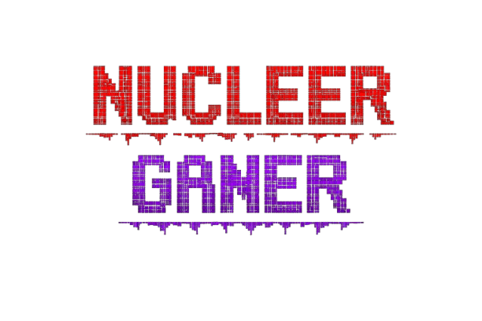

<div align="center">



# NUCLEER GANER

**Advanced Discord Nuke & Server Management Tool**  
**Developed by leoniofficials – 2026**<br>
*Discord Nuker with Bot Token*<br>


> Powerful Discord server nuke tool, over 30 destructive/administrative commands, and full control.

</div>

---

## Languages
- **[English](#english-version)**
- **[Türkçe](#türkçe-versiyon)**

---

## English Version

### Features
- 30+ administrative commands
- Confirmation system for critical actions
- Webhook & emoji spam utilities

### Legal Disclaimer
> This tool is for **educational purposes only** and must be used **only on servers you own or have explicit permission** to manage.  
> Unauthorized use violates **Discord Terms of Service**.  
> The developer is **not responsible** for misuse.

###  Screenshots
<div align="center">
  
</div>

###  Installation

#### Requirements
- Python **3.10+**
- Valid **Discord Bot Token** (not user token)

#### 1. Clone Repository
```bash
git clone https://github.com/leoniofficials/Discord-Nuker-with-Bot-Token
cd Discord-Nuker-with-Bot-Token
```

#### 2. Install Dependencies
```bash
pip install -r requirements.txt
```

#### 3. Run the Tool
```bash
python nucleer.py
```

You will be prompted to securely enter your **Bot Token** at startup.

###  Usage
- Select target if multiple servers are detected
- Dangerous actions require confirmation keywords

####  Popular Commands
| Command | Description |
|-------:|------------|
| 05 | Delete all channels (NUKE) |
| 07 | Delete all roles |
| 10 | Ban all members (MASSBAN) |
| 13 | Webhook spam |
| 18 | DM all members (MASSDM) |
| 22 | Rename server |

###  Project Structure
```text
discord-nuker/
├── nucleer.py
├── requirements.txt
├── README.md
├── screenshots/
└── .gitignore
```

###  Contributing
- Fork the repository
- Create a feature branch
- Commit changes
- Open a Pull Request

---

## Türkçe Versiyon

###  Özellikler
- Matrix tarzı başlangıç animasyonu
- Kesintisiz konsol girişi
- 30+ yönetimsel komut
- Kritik işlemler için onay sistemi
- Webhook & emoji spam araçları

###  Yasal Uyarı
Bu araç **yalnızca eğitim amaçlıdır**.  
Sadece **sahibi olduğunuz veya izin verilen** sunucularda kullanın.  
Geliştirici, kötüye kullanımdan sorumlu değildir.

###  Kurulum;

#### Gereksinimler
- Python **3.10+**
- Geçerli **Discord Bot Token**

#### Kurulum
```bash
git clone https://github.com/leoniofficials/Discord-Nuker-with-Bot-Token
cd Discord-Nuker-with-Bot-Token
pip install -r requirements.txt
python nucleer.py
```

###  Kullanım
- Tek sunucu varsa otomatik kilitlenir
- Komutları `root@nucleer:~#` satırından girin

#### Popüler Komutlar
- `05` → Tüm kanalları sil (NUKE)
- `10` → Tüm üyeleri banla (MASSBAN)
- `18` → Herkese DM at (MASSDM)


*Geliştirici / Developer*<br>
*leoniofficials*<br>
*GitHub:* *https://github.com/leoniofficials*<br>


questions?:<br>
*discord*:**leoniofficials**<br>
*website*:**sususoftware.xyz**

---
- 🤝 Contributing
- *just a drop star ⛥*
